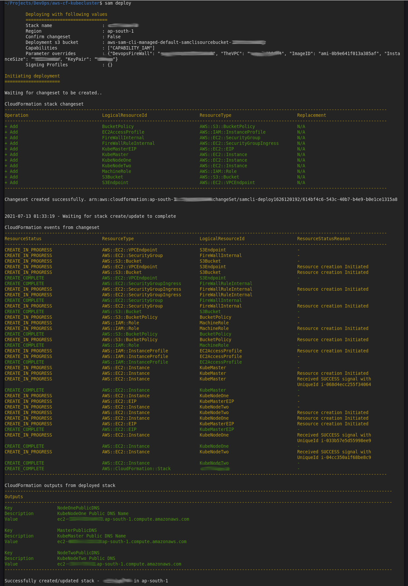

# Minimal Kubernetes Cluster with AWS EC2

This is just an academic project as part of DevOps Masters Program with [Simplilearn](https://www.simplilearn.com/devops-engineer-masters-program-certification-training). Though the original project is to learn k8s, which can be done in any way we wish, this full sam deployment to the node joining was just a challenge that I put to myself.

The parameters are DevopsFireWall (a security group id which has open permission from my ip only and already existing), TheVPC (id of an existing VPC), ImageID (AMI id, prefer ubuntu 20.04), InstanceSize (the EC2 instance Size), KeyPair (ssh keypair, should already exist). Resources that are created are an S3 Bucket (just for dropping the join command from kubeadm init), a VPC Endpoint for the S3 Bucket to assign EC2 AccessPolicy and EC2 Role with permissions to access the bucket, an internal security group with fully open ingress rules attached with source itself (enables multipe EC2 attached with this SG to communicate freely), three EC2 instances with the AMI, security groups, AccessProfile etc, with one of them as Master Node. The Master Node create is a dependency for the other two nodes. Whole of the software requirements are included in the **kube-bootstrap.sh** and this should be hosted somewhere. The extra commands for the Master Node is in the **kube-init-cluster.sh** and this also should be hosted somewhere. For the time, these are hosted on my [wordpress hosted on s3](https://www.jijutm.com) and properly linked in the template.  Parts of the cluster init shell script have been created to be pushed into background to reduce the overall time for deployment to complete.

Normally I do not run the -g, instead directly create a samconfig.toml ;) ofcourse from a static reference and make sure the values match. 

[Kubernetes Cluster with Vagrant and VirtualBox](../../kubernetes-cluster) Similarly using Vagrant and VirtualBox, bit more easy as there we know the IP adresses and we have a common directory path mapped into the systems, whereas here these had to be worked out.