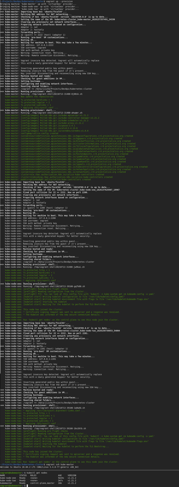

# Kubernetes Cluster with Vagrant and VirtualBox 

This is just an academic project as part of DevOps Masters Program with [Simplilearn](https://www.simplilearn.com/devops-engineer-masters-program-certification-training). Though the original project is to learn k8s, which can be done in any way we wish, this full deployment to the node joining was just a challenge that I put to myself.

Nothing much fancy here, just three nodes with ubuntu/focal64 (20.04) and post launch shell scripts to install everything.

From the above screenshot, lots of verbose messages from apt and other configuration are removed when stitching together, to limit the image size.

[AWS/EC2 Kubernetes Cluster](../aws/aws-cf-kubecluster) Similarly using AWS::EC2::Instance (s), bit more tough as here we know the IP adresses and we have a common directory path mapped into the systems, whereas there these had to be worked out.;) jthoma stands for Jiju Thomas Mathew, which is my full name
